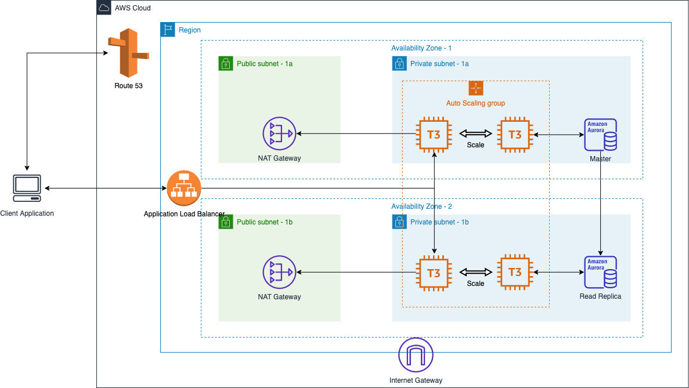

## AWS web application architecture

#### Requirements
- Clothes rental startup like [RTR](https://www.renttherunway.com/).
- Need to handle traffic spikes on every Wednesday when new items are released.
- High Availability & Disaster Recovery

#### Architecture
- EC2 (1 year convertible reserved t3.medium) + EC2  (t3.medium spot instance)
- ASG (Min Size 2 / scale out 5 min before new item release message has been sent. / scale in cpu utilization is under 20% for 5 min.)
- MySQL compatible Aurora of t3.medium.
- Master + read replica

