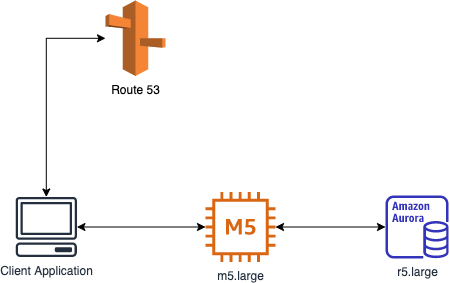
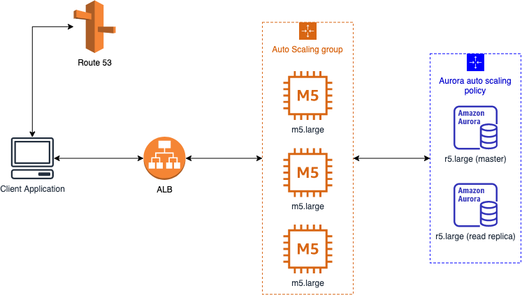
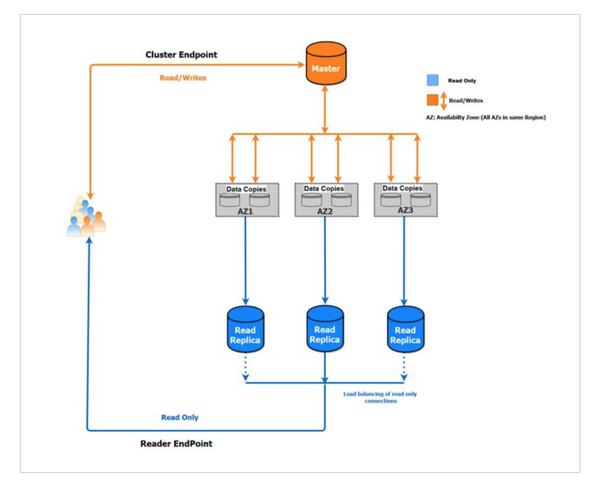

## AWS auto scaling plan for ticket platform

#### Requirements
- Your client wants to launch a new feature to an existing online movie ticket platform like [MEGA BOX](https://www.megabox.co.kr/). A new feature is opening limited numbers of a free ticket for the upcoming movie. Tickets are available at a specific date that is notified a week before the opening.
- The platform usually has 50-100 concurrent users during the day.
- It is expected that 1,500-2,000 concurrent users will be on the platform.
- Current architecture is shown below.

#### Architecture

- **EC2 auto-scaling**: Use ASG to scale out to max 3 instances 10 min before ticket opening. Scale in when CPU utilization in under 20% for 15 min.
- **Aurora scale-out / in**: Use Aurora auto-scaling policy to create read replicas up to 3. The scaling policy is based on the database connection.
- **Aurora scale up / down**: AWS does not support auto-scale up for EC2 & Aurora. However, since aurora has only one master (write) instance, scaling up the master instance is needed if write-intensive traffic loads on the master instance. In this case, create a new read replica with a bigger size and set the priority high. Then, failover the master, which makes the new bigger read replica to the new master instance.
- **Read / Write intensive traffic**: Aurora has a Reader-Writer cluster structure. So you should separate read traffic and write traffic to reduce high traffic on the master (writer) instance.

- **Query Optimization**: Query Optimization is super important to reduce memory loads on the database.

#### References
- [wanted team blog](https://medium.com/wantedjobs/rds-mysql%EC%9D%84-rds-aurora%EB%A1%9C-%EC%9D%B4%EC%A0%84%ED%95%98%EA%B8%B0-ad67c857b017)
- [HB Smith blog](https://medium.com/hbsmith/aws-aurora-%EB%8F%84%EC%9E%85%EC%97%90-%EB%8C%80%ED%95%9C-%EB%AA%87%EA%B0%80%EC%A7%80-%EC%82%AC%EC%8B%A4-45eb602bad58)
