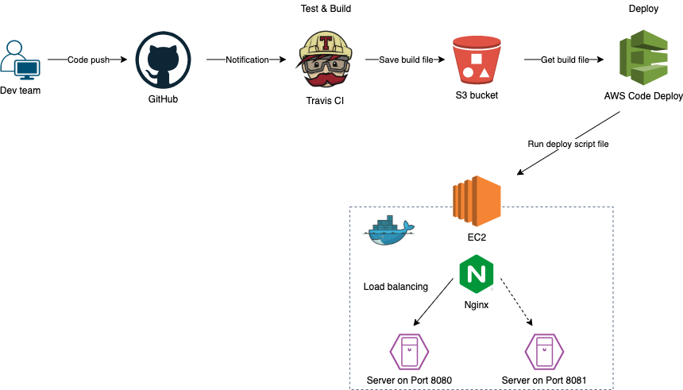

## Continuous Intergration & Continuous Deploy

#### Requirements
- Continuous Intergration
- Continuous Deploy

#### Architecture

1. Push code to version control system like GitHub.
2. Travis CI will detect the changes in source code and start Test & Build.
3. Travis CI saves the build file to the AWS s3 bucket.
4. AWS CodeDeploy will get the message from Travis CI and start the deploy process.
5. CodeDeploy gets the build file from s3 and sends it to EC2.
6. CodeDeploy will also execute the deploy script file on EC2.
7. EC2 will create the docker image file and start a new server on a new port.
8. Once the deploy process is finished, Nginx will change the port to the new port.
