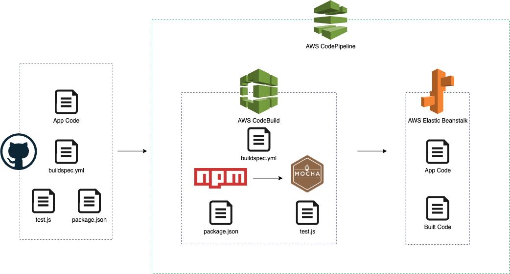

## Continuous Intergration & Continuous Deploy

#### Requirements
- Continuous Intergration
- Continuous Deploy

#### Architecture

1. AWS CodePipeline will detect the Github repository's code changes and start the build process by invoking AWS CodeBuild.
2. AWS CodeBuild will execute the buildspec.yml file to start building.
3. As the buildspec.yml file is executed, npm will install packages, and then MOCHA will process the test.
4. If the build is successfully done, AWS Elastic Beanstalk will deploy the application.
