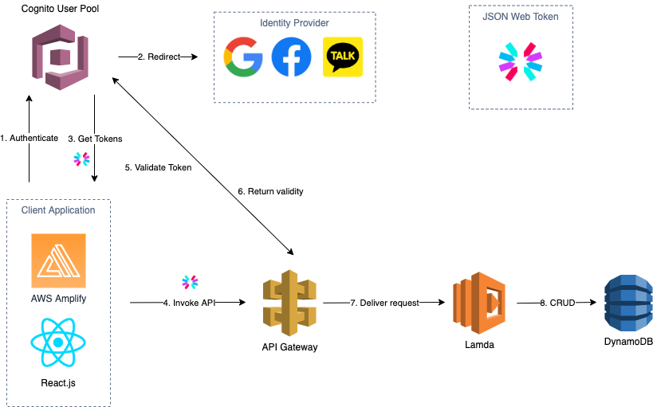

## AWS Cognito Login Architecture

#### Requirments
- Support OAuth login
- Verify email address & phone number
- User can recover their account by email

#### Architecture

- Cognito User Pool: CUP provides sign-up & sign-in options with multiple 3dr party identity providers. Also, It is highly scalable and easy to manage.
- AWS Amplify: Use AWS Amplify as a library to implement authentication on your client application.
- API Gateway: API Gateway works as a gatekeeper to block unauthorized requests.
