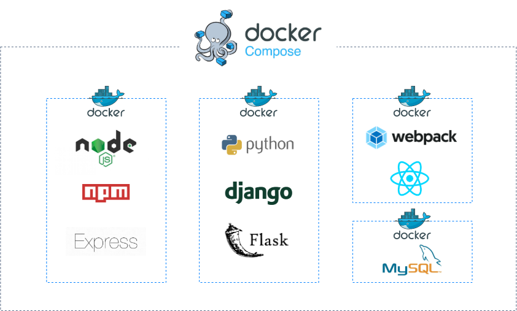

## Docker for Local Development Environment

#### Requirments
- Need to setup the entire development environment.
- The company has a set of services that are nodejs app server, Python admin server, Reactjs frontend web app, and MySQL database.

#### Architecture

- Create a Docker container for each service.
- Use Docker-Compose to manage all containers via a unified interface and run them at once.
- Docker networks setting to make services communicate with each other.
- Docker Volumes to save persistent data.

#### Reference
- https://auth0.com/blog/use-docker-to-create-a-node-development-environment/
- https://www.44bits.io/ko/post/almost-perfect-development-environment-with-docker-and-docker-compose
- https://blog.atulr.com/docker-local-environment/
