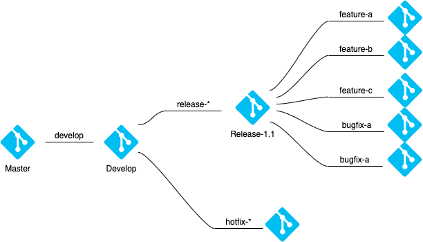
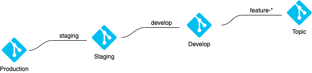

## Git Workflow Strategy

#### Requirments
-

#### Architecture
- Traditional git flow
  - develop branch from master branch.
  - release branch from develop branch.
  - feature / bugfix branch from release branch.
  - developers commit to feature / bugfix branch.
  - merge release branch to develop branch after test.
  - merge develop branch to master branch to deploy.

- Git flow for CI/CD
  - staging branch from production branch.
  - develop branch from staging branch.
  - topic branch from develop branch.
  - developers commit to topic branch.
  - merge topic branch to develop branch after local test and use **--squash option** to maintain one commit for one feature.
  - merge develop branch to staging branch with **interative rebase** to select feature to deploy.
  - merge staging branch to production branch after production environment test.
  

#### Reference
- [Reid Blog](https://blog.ull.im/engineering/2019/06/25/git-workflow-for-ci-cd.html)
