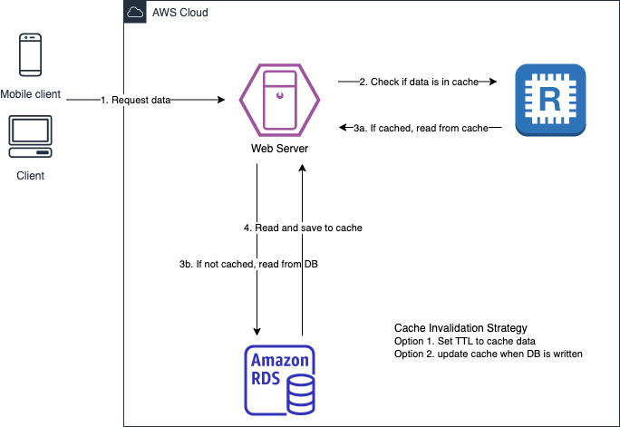

## Search feature implemented by ElastiCache

#### Requirments
- Your client has an eCommerce website that sells books. One of the main features is showing the 30 most sold books online.
- Recently, the main feature got slow as the number of books and sales gets larger. You are asked to solve this problem.

#### Architecture

- Factors that should be considered before using cache.
  - Speed and expense: If the data requires a slow and expensive query to get, it's a candidate for caching.
  - Data and access pattern: If the data changes quickly or is seldom accessed, it is not a good fit for the cache. For caching to provide a real benefit, the data should be relatively static and frequently accessed.
  - Staleness: To tell whether your data is a candidate for caching, determine your application's tolerance for stale data.
- Redis
  - Multi AZ with Auto-Failover
  - Read Replicas to scale reads and have high availability
  - Data Durability using AOF (Append Only File) persistence
  - Backup and resotre features
- MEMCACHED
  - Multi-node for partitioning of data (sharding)
  - Non persistent
  - No backup and restore
  - Multi-threaded architecture
- Using cache involves heavy application code changes.
- Cache must have an invalidation strategy to make sure only the most current data is used in there.
- Patterns for cache
  - Adds or update data in the cache when written to a DB.
  - Store data in a cache using TTL features.

#### Reference
- [AWS Docs](https://docs.amazonaws.cn/en_us/AmazonElastiCache/latest/red-ug/elasticache-use-cases.html)
