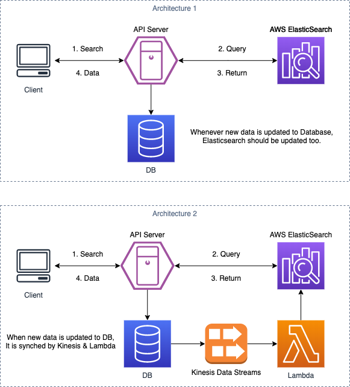

## Search feature implemented by Elasticsearch

#### Requirments
- The existing application has a search feature that is getting slower as the data in the database gets bigger.
- Your client wants to make the search feature gets faster and highly scalable.

#### Architecture

- AWS Elasticsearch: Amazon Elasticsearch Service (Amazon ES) is a managed service that makes it easy to deploy, operate, and scale Elasticsearch clusters in the AWS Cloud.
- Data Migration: There are several ways to import existing data from Database to Elasticsearch. 1) Write a script that imports data. 2) Use Logstash to migrate data to Elasticsearch.
- Data Sync: Synchronization can be done by updating both DB and ES whenever new data comes. Using Kinesis and Lambda to update ES automatically is another way to achieve synchronization. Implementation with Kinesis is more scalable if the system gets bigger and complex.

#### Reference
- [Coding Explained](https://www.youtube.com/watch?v=yZJfsUOHJjg)
- [kmongdev](https://brunch.co.kr/@kmongdev/7)
- [hanbluelblue](https://velog.io/@hanblueblue/Elastic-Search-1)
