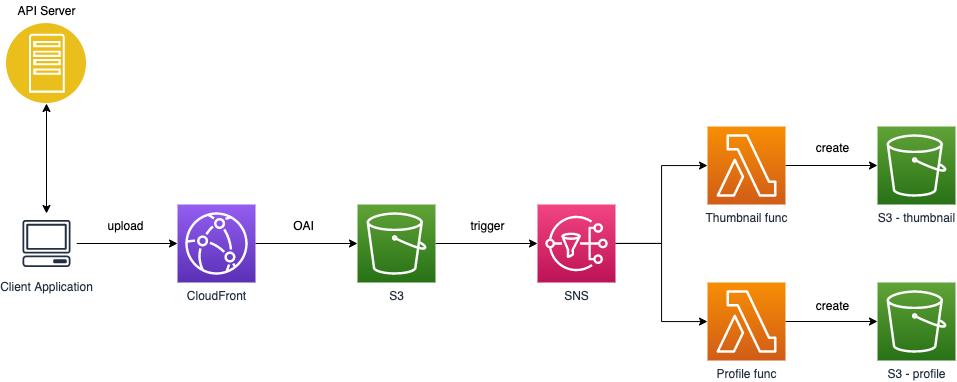

## Serverless Thumbnail Generator

#### Requirments
- Resize images that the user uploaded. (faster delivery & lower costs)
- Profile picture and thumbnail is where the image is used.

#### Architecture

- Serverless: Serverless architecture is a perfect fit for generating thumbnail that the user uploaded to S3. It costs way lower with serverless architecture and decoupled from the API server, making it very easy to manage. Also, serverless architecture is highly scalable.
- OAI: Use Origin Access Identity policy to restrict direct upload to S3.
- SNS: Use SNS when you need to deliver one event to multiple handlers. In this case, SNS triggers the lambda function when the user uploaded the image file to S3.
