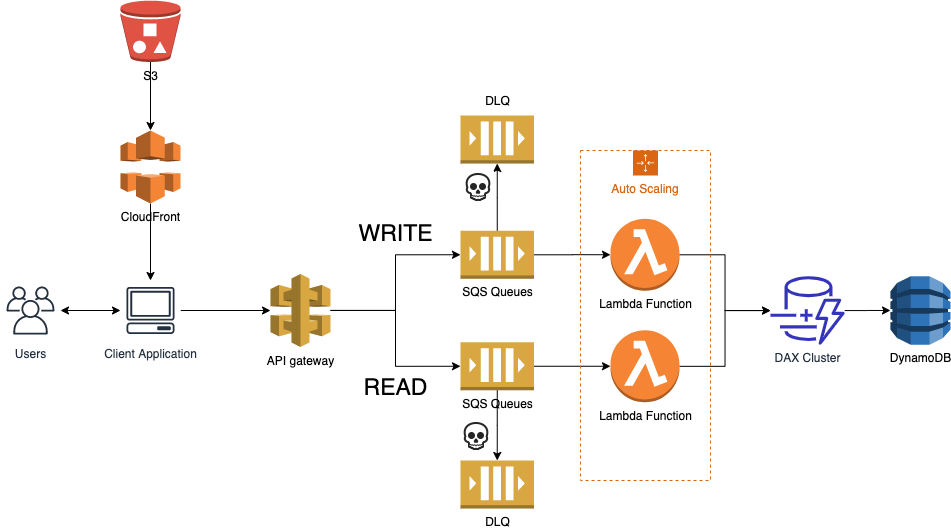

## SQS-Lambda-serverless architecture for Course Registration System

#### Requirements
- You need to design a system architecture for course registration.
- This system will only be used for a week when students register for courses for the next semester.
- There will be about 10,000 students on the website during the course registration.

#### Architecture

- API gateway: Use API gateway to distribute READ / WRITE requests. It will deliver the request to the proper Queue.
- AWS SQS: SQS is for the stable processing of the requests. SQS can handle unlimited throughput.
- DLQ: Dead Letter Queue is used for storing the requests that failed to proceed. It's useful for debugging.
- AWS Lambda: AWS Lambda will poll the messages from SQS and process the messages. **Lambda can only execute 1,000 concurrent functions. But it can be increased up to hundreds of thousands if you ask the AWS support team.** It is expected to have around 10,000 concurrent users, So increase the capacity ahead.
- DAX cluster: DAX cluster works as a cache, and it will be used for improving the performance.
- Prepare Cold Start: [How to improve Lambda cold start](https://lumigo.io/aws-lambda-performance-optimization/how-to-improve-aws-lambda-cold-start-performance/)

#### References
- [lumigo blog](https://lumigo.io/aws-lambda-performance-optimization/how-to-improve-aws-lambda-cold-start-performance/)
