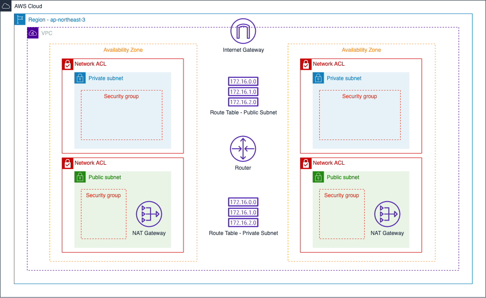

## Virtual Private Cloud with AWS

#### Requirements
- Virtual Private Network using AWS
- At least two Availability Zones

#### Architecture

- With VPC, it is easy to create a sperate network so that multiple services are separated by each VPC.
- Subnets are used for dividing VPC into multiple sub-network. There are Private Subnet and Public Subnet.
- When there is a request to the VPN, Router & Route Table are used for finding the destination.
- Internet Gateway is a bridge to connect the internet with VPC.
- NAT Gateway is for a private subnet to send outbound traffic to an internet gateway.
- Network ACL is a firewall for a subnet. It allows all traffic by default.
- Security group is a firewall for an instance like EC2, ALB, DB, Etc. It blocks all traffic by default.

#### Reference
- [Link1](https://medium.com/harrythegreat/aws-%EA%B0%80%EC%9E%A5%EC%89%BD%EA%B2%8C-vpc-%EA%B0%9C%EB%85%90%EC%9E%A1%EA%B8%B0-71eef95a7098)
- [Link2](https://tech.cloud.nongshim.co.kr/2018/10/16/4-%EB%84%A4%ED%8A%B8%EC%9B%8C%ED%81%AC-%EA%B5%AC%EC%84%B1%ED%95%98%EA%B8%B0vpc-subnet-route-table-internet-gateway/)
- [Link3](https://www.44bits.io/ko/post/understanding_aws_vpc#%EB%9D%BC%EC%9A%B0%ED%8A%B8-%ED%85%8C%EC%9D%B4%EB%B8%94route-table)
